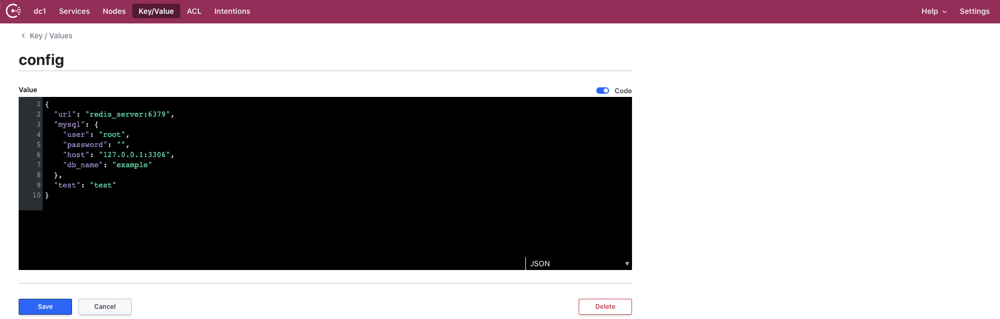

# Go-viper


Github: [https://github.com/golang-collection/Go-viper](https://github.com/golang-collection/Go-viper)

[Viper](https://github.com/spf13/viper)是适用于Go应用程序的完整配置解决方案。它被设计用于在应用程序中工作，并且可以处理所有类型的配置需求和格式。

本项目演示了读取本地配置文件和consul的key/value配置。

# 目录结构
```
- config 配置文件存放位置
- normal 读取本地配置文件
- remote 读取远程配置文件
```

# 读取本地配置文件
在config文件夹下创建config.json文件，如下所示：
```json
{
  "mysql": {
    "user": "root",
    "password": "",
    "host": "127.0.0.1:3306",
    "db_name": "example"
  },
  "redis": {
    "host": "127.0.0.1:6553"
  },
  "rabbitmq": {
    "user": "root",
    "password": "root",
    "host": "127.0.0.1:5124"
  }
}
```

核心代码为:

```go
viper.SetConfigFile("/Users/super/develop/Go-viper/config/config.json") //文件名
err := viper.ReadInConfig() // 会查找和读取配置文件
```

更多细节：[normal](./normal)

# 读取远程key/value
在consul的key/value中创建config，例如：


核心代码为：

```go
err := viper.AddRemoteProvider("consul", config.CONSUL_URL, config.CONSUL_CONFIG)
if err != nil {
	return err
}
viper.SetConfigType("json") // Need to explicitly set this to json
err = viper.ReadRemoteConfig()
```

更多细节：[remote](./remote)

# Install

```bash
go get github.com/spf13/viper
```

# What is Viper
Viper可以适配任何应用程序，可以处理所有类型的配置需求和格式。它支持:

- 设置默认值
- 读取JSON, TOML, YAML, HCL, envfile和Java属性配置文件
- 实时查看和重新读取配置文件(可选)
- 从环境变量中读取
- 从远程配置系统(etcd或Consul)读取，并观察变化
- 从命令行标志读取
- 读取缓冲区
- 设置明确的值

# License
[MIT](./LICENSE)

Copyright (c) 2020 golang collection